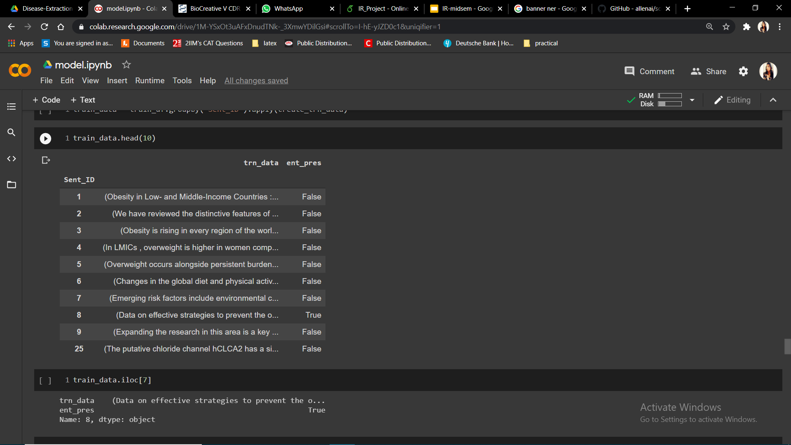
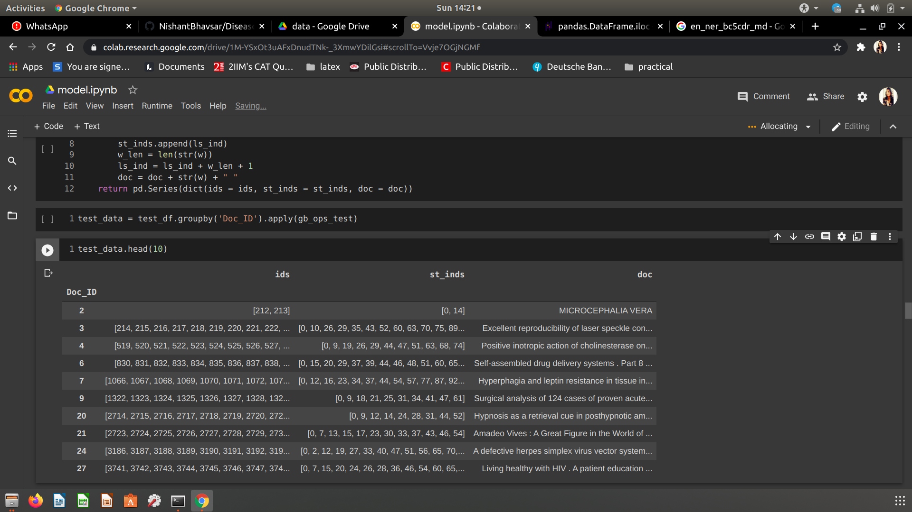
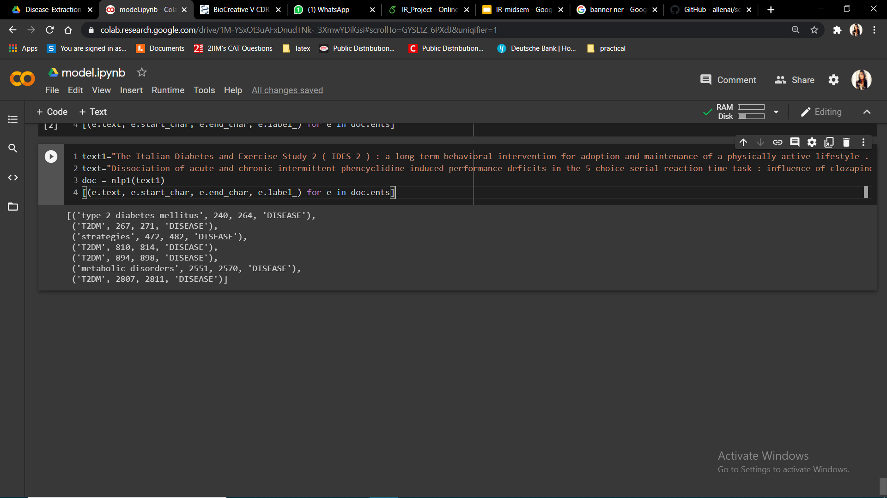

# IR-Project-Clinical-Natural-Language-Processing-for-Automated-Disorder-Normalization-
Team 12: Alisa P (171IT207) , Vandana S (171IT246) , Sreeja (171IT114)

Model run using Goggle Collaboratory.

Dataset:  https://www.kaggle.com/rsnayak/hackathon-disease-extraction-saving-lives-with-ai?select=train_3PIRKSI
The dataset have total 30,000 documents and 191,282 sentences in total. It has total 4,543,833 unique id(words) which means each record is assigned unique id. A screenshot of the dataset.

The training data containg the text of one document and all occurences of diseases in that text as "entities"
Test data contains texts of whole doc which the model will use to predict the disease. It is shown in figure below.

When text input is given the model extracts all occurences if disese in that text. It is shown in figure below.

